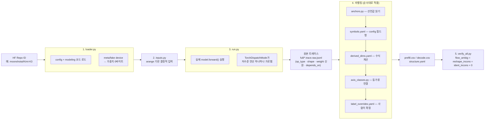
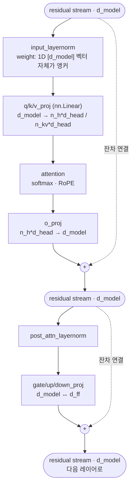
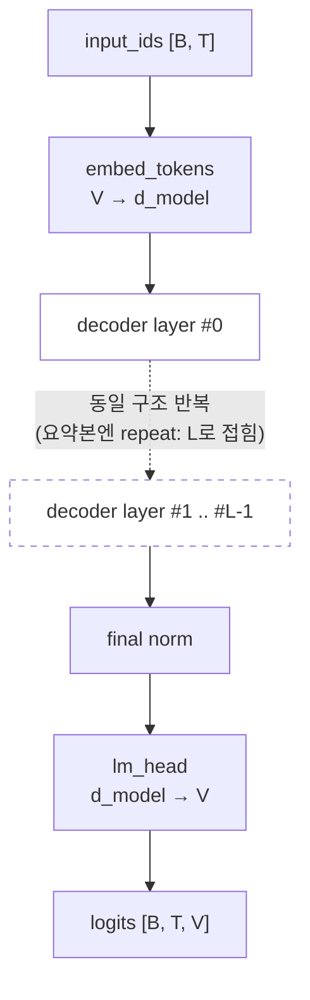

# llm-arch-tracer 동작 원리

## 이 도구는 무엇인가

`llm-arch-tracer`는 HuggingFace에 공개된 LLM을 **실제로 로드해서**(단, 가중치 없이 — `meta` device) 레이어 단위로 어떤 연산이 어떤 순서로 실행되고, 각 텐서의 shape이 서로 어떤 의존 관계를 갖는지를 자동으로 뽑아내는 도구입니다.

- **입력**: HuggingFace 모델 저장소 ID (예: `moonshotai/Kimi-K3`)
- **처리**: `src/`의 Python 코드가 파이프라인을 직접 실행합니다 — 모델 구조 로드 → 결정적 입력 생성 → `model.forward()` 실행(이 실행 **도중** `TorchDispatchMode`가 저수준 연산을 하나하나 실시간으로 가로채 기록 — "먼저 실행하고 나중에 가로채는" 별개의 두 단계가 아니라 한 번의 실행 안에서 동시에 일어납니다) → 기록된 원본 트레이스에 이름 붙이기(`rules/*.yaml` 규칙 매칭) → 자동 검사(게이트)로 모순 여부 확인
- **출력**: 레이어마다 어떤 연산이 돌았는지, 각 텐서 shape이 `[B, n_h, T, d_head]`처럼 아키텍처 의미가 있는 이름으로 어떻게 나오는지 정리한 표(`prefill.csv`/`decode.csv`)와 구조 요약(`structure.yaml`, `model_summary.md`)

한 가지 짚어둘 것: `01-main.md`류 `.md` 문서들은 실행 순서를 지시하는 스펙이 아니라 **이 프로젝트가 따르는 방법론·정책 문서**입니다. 실제 동작은 전부 Python 코드가 결정하고, 이름을 붙이는 규칙 자체는 `rules/*.yaml`(YAML 데이터)에 있습니다 — 코드가 실행 순서를, 규칙 파일이 이름 붙이는 기준을, `.md` 문서가 "왜 이렇게 하기로 했는지"를 각각 담당합니다.

전체 흐름은 아래 "1. 전체 파이프라인"의 그림과 같습니다.

---

이 문서는 `llm-arch-tracer`가 **정확히 무엇을 어떤 순서로 실행해서** 결과를 만들어내는지 설명합니다.
목적은 "대충 이런 느낌"이 아니라 "이 코드가 이 순서로 돈다"를 정확히 아는 것입니다.

---

## 0. 결론부터

| 질문 | 답 |
|---|---|
| 트레이스가 정적(static)인가? | **예.** 가중치가 없고 입력이 결정적이라 같은 조건이면 항상 같은 원본 트레이스가 나옵니다. `--check-repro` 게이트(C13)로 자동 검증됩니다. |
| 라벨링도 정적인가? | **예, 별개로 한 번 더 그렇습니다.** 규칙 파일 매칭도 무작위·LLM 호출 없이 결정적 코드라, 같은 트레이스 + 같은 규칙 파일이면 라벨도 항상 같게 나옵니다. |
| LLM이 결과를 생성하는가? | **아니요.** 트레이스와 라벨링 전 과정은 결정적 Python + 규칙 파일 매칭입니다. LLM은 **규칙을 새로 쓸 때만**, 그것도 트레이스 실행과 분리된 별도 오프라인 작업으로만 관여합니다. |
| 심볼이 전체 레이어를 타고 연결이 유지되는가? | **대부분 유지되고, 유지되는지를 자동으로 검사합니다.** 축이 사라지는 연산(예: `sum`)을 지나면 실제로 연결이 끊길 수 있고, 그럴 땐 억지로 잇지 않고 숫자로 남깁니다. |

아래부터 근거·예시·그림과 함께 풀어씁니다.

---

## 1. 전체 파이프라인



### 1단계 — 구조만 로드 (`src/loader.py`)

```python
with torch.device("meta"):
    model = AutoModelForCausalLM.from_config(cfg, trust_remote_code=trust_remote_code)
```

`meta` device는 텐서의 **shape과 dtype만 있고 실제 데이터(가중치 값)는 없는** PyTorch 모드입니다. 이 시점에 진짜 가중치는 1바이트도 다운로드/할당되지 않습니다. 일부 모델(Kimi-K3 포함)은 코드 중간에 `.item()`처럼 텐서의 **실제 값**을 읽으려는 지점이 있어 `meta`만으로는 안 돌아가는데, 그럴 땐 `FakeTensorMode`로 자동 전환합니다(`src/loader.py:load_fake`).

### 2단계 — 입력 만들기 (`src/inputs.py`)

```python
ids = (torch.arange(seq_len) % vocab).view(1, -1)
```

입력 토큰은 `0, 1, 2, ...` 순서로 나열한 값입니다. 실제 텍스트가 아니라 "shape을 흘려보내기 위한 자리표시자"라 값 자체는 의미가 없고 완전히 결정적입니다.

### 3단계 — 진짜로 forward()를 실행 (`src/run.py`)

```python
with torch.no_grad(), tracer:
    out = model(**kwargs)
```

**모델의 실제 Python forward 코드가 그대로 실행됩니다.** `tracer`는 `TorchDispatchMode`라는 PyTorch 기능을 씁니다. 모든 텐서 연산은 결국 `aten.mm.default`처럼 아주 낮은 단계의 "dispatch" 호출로 수렴하는데, 이 모드 안에서 실행하면 **그 호출 하나하나를 가로채서 기록**합니다.

### 4단계 — 라벨링 (여러 층이 순서대로 적용됨)

1. **`src/anchors.py`** — 각 연산이 실제로 쓴 weight 객체를 찾아가 그 weight가 코드에서 선언한 폭을 그대로 읽음 (1순위, 제일 강력)
2. **`rules/symbols.yaml`** — config 필드 이름 매칭 (`hidden_size`/`d_model`/`n_embd` 등 별칭 흡수)
3. **`rules/derived_dims.yaml`** — 코드에서만 계산되는 값을 수식으로 미리 계산해 대조
4. **`src/axis_classes.py`** — `view`/`transpose`처럼 같은 텐서가 반복 등장하는 자리를 전부 묶음 (등가류)
5. **`rules/label_overrides.yaml`/`label_confirmed.yaml`** — 위로 못 가리는 자리는 사람이 소스를 읽고 확정 (유일하게 사람/LLM이 관여하는 지점, 트레이스 실행과 분리된 오프라인 작업)
6. **`src/build_table.py`/`summarize.py`** — 최종 표 조립

### 1-1. 1~3번, 실제로 코드에서 어떻게 도는지

세 개 다 **파이썬 함수가 트레이스 행과 모델 객체/config 객체를 놓고 그 자리에서 계산하는 것**이지, 미리 만들어둔 표를 찾아보는 것도, 무언가 추론하는 것도 아닙니다.

**① `src/anchors.py` — weight 객체까지 실제로 찾아감**

```python
def weight_param(params):
    # params = ["model.layers.0.self_attn.q_proj.weight"] 같은 문자열 리스트
    ws = [p for p in params if not p.endswith(".bias")]
    return ws[0] if len(ws) == 1 else None

def module_key(module_path):
    # 레이어 번호를 지워서 "레이어가 달라도 같은 자리"로 인식
    # model.layers.7.self_attn.k_proj -> model.layers.*.self_attn.k_proj
    return re.sub(r"\.(\d+)(?=\.|$)", ".*", module_path)
```

`params` 필드의 문자열(`"...q_proj.weight"`)에서 마지막 `.weight`를 떼면 그 파라미터를 소유한 모듈의 실제 경로(`...q_proj`)가 나오고, 그 경로로 실행 중인 모델 객체(`model`)에서 진짜 `nn.Linear` 인스턴스를 찾아 `.in_features`/`.out_features`를 읽습니다. **`module_key`가 레이어 번호를 지우는 이유**가 중요한데 — 이러면 "레이어 0의 `q_proj`"와 "레이어 31의 `q_proj`"가 같은 자리로 인식되어, **한 번만 계산하고 32개 레이어 전부에 같은 라벨을 재사용**합니다(전부 같은 구조의 클래스라 결과도 항상 같음). 이게 앞서 나온 "규칙이 수렴한다"의 실체입니다 — 레이어 수가 늘어도 계산량이 안 늘어남.

이 방식이 막는 것은 정확히 이런 상황입니다: `n_h`(head 개수)와 `d_head`(head 폭)가 이 체크포인트에서 우연히 같은 숫자라면, 값만 보고는 절대 못 가릅니다. 그런데 `k_proj`가 몇 개의 head를 몇 폭으로 내보내는지는 **그 모듈이 어떤 모듈인지 자체가 답**입니다 — 어떤 숫자를 담고 있든 상관없이요. anchors.py는 그 사실(모듈의 정체성)을 직접 읽고, 우연한 숫자 일치는 애초에 볼 필요조차 없게 만듭니다.

**② `rules/symbols.yaml` — 진짜 Python 객체 속성 조회**

```python
def _first_attr(cfg, aliases):
    for a in aliases:            # 예: ["hidden_size", "d_model", "n_embd"]
        if hasattr(cfg, a):
            return getattr(cfg, a)   # 있으면 그 값을 바로 반환
    return None
```

`cfg`는 `AutoConfig.from_pretrained(...)`로 만들어진 **진짜 config 객체**입니다. `hasattr`/`getattr`는 파이썬의 가장 기본적인 속성 조회 함수이고요 — 별칭 리스트를 순서대로 돌면서 "이 config 객체가 이 이름의 속성을 갖고 있나?"를 하나씩 확인하고, 처음 걸리는 걸 그대로 씁니다. 모델을 실제로 만들 때 쓴 그 config 인스턴스를 그대로 조회하는 것이라 오타나 짐작이 끼어들 자리가 없습니다.

**③ `rules/derived_dims.yaml` — 샌드박스 `eval()`로 수식 계산**

```python
val = eval(rule["expr"], {"__builtins__": {}}, ns)
```

`rule["expr"]`은 `"T // m_csa"`, `"round(d_head * pr)"` 같은 **YAML에 적힌 문자열**입니다. `ns`는 이미 ①②로 확정된 심볼 값들의 딕셔너리(`{"d_head": 512, "pr": 0.125, ...}`)입니다. `{"__builtins__": {}}`로 `eval`을 감싼 게 핵심인데 — 이러면 `import`, `open`, 파일 접근 같은 게 전부 막히고 **순수 산술 계산만** 가능합니다. 수식에 필요한 심볼 값이 이 모델에 아예 없으면(`ns`에 없는 이름을 쓰면) `NameError`가 나고, 그건 "이 규칙이 이 모델엔 해당 안 됨"으로 조용히 처리됩니다(에러가 나면 그냥 `None` 반환).

세 개 공통점: **트레이스 행의 정보(어느 weight를 썼는지) + 실행 중인 모델/config 객체를 그 자리에서 직접 조회**하는 것이라, "규칙 파일에 적힌 대로 코드가 기계적으로 계산"하는 것 그 자체입니다. 세 곳 다 사람이 미리 "이 모델은 이런 값이겠지" 하고 하드코딩해둔 게 없습니다.

### 1-2. 4~6번도 마저

**④ `src/axis_classes.py` — union-find로 "같은 축" 자동 판정**

```python
class _UF:                       # 표준 union-find, 경로 압축까지 그대로
    def find(self, x): ...
    def union(self, a, b): ...

# 슬롯 하나 = (op_id, "i"|"o", 몇 번째 피연산자/출력, 축 번호)
```

각 축 자리를 `(op_id, 입력인지출력인지, ..., 축번호)`라는 슬롯으로 표현하고, 이 슬롯들 사이에 "같은 축이다"라는 간선을 두 가지 규칙으로만 긋습니다:

1. **생산자→소비자**: A 연산의 출력 shape과 B 연산의 입력 shape 중 한 조각이 **정확히 똑같고**, 그 대응이 유일할 때만(모호하면 안 이음) 두 슬롯을 묶습니다.
2. **shape 보존 연산**: `elementwise_add`처럼 입력 shape과 출력 shape이 완전히 같은 연산은, 크기가 1보다 큰 축에 한해 입력=출력으로 묶습니다(크기 1인 축은 브로드캐스트라 "같은 축"이 아니라 "복제되는 축"이라 제외).

**핵심은 이 두 간선이 전부 "실제 정수 shape"만 보고 정해진다는 겁니다** — 이미 렌더된 이름을 보고 잇지 않습니다. 왜냐면 이름을 보고 이으면, 이미 틀린 이름끼리도 "이름이 같으니 같은 축"이라고 묶어버려서 틀림을 확정해버리기 때문입니다. 그래서 라벨링 이전에 순수하게 **모양의 사실**만으로 등가류를 먼저 확정하고, 그 다음에 이름을 얹습니다.

**⑤ `rules/label_overrides.yaml`/`label_confirmed.yaml` — 선택자 기반 매칭**

오버라이드 하나는 이런 필드로 구성됩니다: `model`(어느 모델), `module`(모듈 경로 정규식), `shape`(정확히 이 shape일 때만), `axis`(몇 번째 축), `op_type`, `expect`(실제 정수 크기가 이 값이어야만), `from`/`to`(이 이름을 저 이름으로). 적용 코드는 트레이스의 모든 행을 돌면서 **이 조건 전부**를 만족하는 자리만 정확히 골라 이름을 바꿉니다 — 하나라도 안 맞으면 그 행은 안 건드립니다. `expect`가 있어서, 값이 다른 엉뚱한 자리에 실수로 적용될 수가 없습니다.

`spread: class`가 켜져 있으면, 그렇게 고친 자리가 속한 **④의 등가류 전체**를 찾아서 같은 이름으로 한꺼번에 바꿉니다 — 한 곳만 고치고 그 텐서의 다른 등장 자리는 옛 이름으로 남는 걸 막는 장치입니다.

**⑥ `src/build_table.py`/`summarize.py` — 여러 판정을 한 표로 합침**

앞 단계들이 각자 "이 자리는 이 이름"이라고 판정한 결과를 실제 표의 각 셀에 써넣고, 서로 어긋나는 판정이 있으면 조율하는 조립 단계입니다. 예를 들어 `matmul`의 두 피연산자가 만나는 축(수축 축)은 양쪽에서 각각 이름이 나올 수 있는데, 두 이름이 다르면 그중 **더 강한 근거를 가진 쪽**(앵커 > config매칭 > 값매칭)을 최종 채택하는 식의 조율 로직이 여기 모여 있습니다. 최종적으로 `prefill.csv`/`decode.csv`/`structure.yaml`/`model_summary.md` 형태로 파일에 씁니다.

### 5단계 — 게이트 검사 (`develop/verify_all.py`)

산출물이 자기모순 없이 일관적인지 자동 검사 (3절에서 설명).

---

## 2. 구체적 예시 — 숫자 하나가 이름을 얻기까지

`meta-llama/Llama-3.1-8B`의 `q_proj`로 실제 과정을 따라가 봅니다. 이 모델은 `hidden_size=4096`, `num_attention_heads=32`, `head_dim=128`입니다.

**① 원본 트레이스에 찍히는 것 (라벨링 전)**
```json
{"op_type": "mm", "input_shape": [[17, 4096], [4096, 4096]],
 "output_shape": [[17, 4096]],
 "params": ["model.layers.0.self_attn.q_proj.weight"]}
```
숫자만 보면 **입력의 4096과 출력의 4096이 같은 값**입니다. `hidden_size`(4096)와 `n_h*d_head`(32×128=4096)가 우연히 똑같은 숫자죠. 값만 보고 이름 붙이면 이 둘을 구별할 방법이 없습니다.

**② 앵커가 하는 일 (`src/anchors.py`)**
`params` 필드의 `q_proj.weight`를 실제 모듈 객체까지 따라가면:
```python
self.q_proj = nn.Linear(hidden_size, num_heads * head_dim)  # in=4096, out=4096
```
이 weight는 **`in_features=hidden_size`, `out_features=num_heads*head_dim`으로 선언됐다**는 사실을 코드 자체가 갖고 있습니다. 두 4096이 같은 값이라는 것과 무관하게, "이 weight의 첫 번째 축은 out(=n_h*d_head), 두 번째 축은 in(=d_model)"이라는 게 이미 정해져 있는 사실입니다.

**③ 최종 라벨**
```
input_shape:  [[T, d_model], [d_model, n_h*d_head]]
output_shape: [[T, n_h*d_head]]
```
값은 똑같이 4096/4096이지만, 이름은 **`d_model`과 `n_h*d_head`로 명확히 구별**됩니다. 이게 "값을 보고 짐작"과 "선언을 읽는다"의 실질적 차이입니다 — 이 예시처럼 값이 우연히 같아도 절대 안 헷갈립니다.

---

## 3. 정적(static)인가 — 트레이스와 라벨링을 나눠서

### 3-1. 트레이스가 정적인 이유

- 가중치 값이 아예 없음 (meta/fake 텐서) → 초기화 무작위성이 영향을 줄 수 없음
- 입력이 결정적 (`arange` 기반)
- `model.eval()` → dropout 등 학습 중 무작위 연산 꺼짐
- MoE 라우팅처럼 실제로 값에 의존하는 부분은 애초에 트레이스가 불가능해서, **결정적인 대체 구조**(예: 전문가에게 토큰 균등 분배)로 바꿔 처리 — 이것도 매번 동일하게 동작

`src/run.py`에 **`--check-repro`** 옵션이 실제로 있습니다 — 트레이스를 두 번 돌려 정말 똑같이 나오는지 자동 검증하는 게이트(C13)입니다.

### 3-2. 라벨링도 별개로 정적인 이유

라벨링 단계(2절의 4단계)는 트레이스와 **완전히 분리된 두 번째 결정적 프로세스**입니다:

- 규칙(`rules/*.yaml`)은 그냥 정적 텍스트 파일 — 같은 파일이면 같은 매칭 결과
- 후보가 여러 개일 때 뭘 고를지는 `priority` 같은 **고정된 숫자 필드**로 결정 (무작위 선택 없음)
- 규칙 적용 순서는 파일에 적힌 리스트 순서 그대로 (Python은 리스트/딕셔너리 순서를 보존함)
- **여기에도 LLM 호출이 없습니다** — "이 축 이름이 뭘까"를 실행 중에 LLM에게 물어보는 지점이 트레이스에도, 라벨링에도 없습니다

즉 정적인 것은 트레이스 하나가 아니라 **"트레이스 생성 + 라벨링" 두 단계 각각**입니다. 둘 다 (입력 코드/설정)이 같으면 항상 같은 출력을 내는 순수 함수처럼 동작합니다.

**바뀌는 경우**: 트레이서 코드(`src/`)나 규칙 파일(`rules/`)을 고치면, 그 다음부터는 다른(보통은 더 정확한) 결과가 나옵니다. "정적"은 "코드가 절대 안 바뀐다"가 아니라 "같은 코드 버전이면 항상 같은 출력"이라는 뜻입니다.

---

## 4. 라벨이 전체 레이어에 걸쳐 진짜로 연결되는가

표준적인 디코더 레이어 하나를 놓고, 심볼이 어떻게 흐르는지 그려보면:



**잔차 스트림(residual stream)은 레이어를 관통하며 계속 `d_model` 폭을 유지**합니다. `q_proj`처럼 다른 폭(`n_h*d_head`)으로 **갈라져 나가는 가지**는 `o_proj`에서 다시 `d_model`로 합류해 잔차에 더해집니다. 라벨이 안 끊기는지는 정확히 이 "갈라짐→합류" 지점들이 실제로 값이 맞는지를 확인하는 문제입니다.

### 4-1. 같은 텐서 안에서의 연결 — `spread: class`

한 텐서는 트레이스 안에서 **여러 번 등장**합니다: 그걸 만든 연산의 출력에 한 번, 소비하는 모든 연산의 입력에 또 한 번씩. `src/axis_classes.py`는 `view`/`transpose`/`reshape`처럼 축을 새로 만들지 않고 순서만 바꾸는 연산을 따라가며 "이 자리들은 물리적으로 같은 축"이라는 걸 자동으로 묶습니다(등가류). 오버라이드에 `spread: class`를 쓰면, 한 자리에서 확정한 이름이 **그 등가류 전체**에 한꺼번에 적용됩니다.

### 4-2. 이 연결이 안전한지 — 자동 검사 3종

- **`flow_ambig`**: 같은 텐서인데 자리마다 이름이 다르면 걸림
- **`reshape_incons`**: `view`/`reshape`의 입력·출력 축 곱이 이름 기준으로 계산해도 실제로 같은 값인지 확인, 안 맞으면 걸림
- **`ident_incons`**: 같은 파라미터가 연산마다 다른 이름을 달고 있으면 걸림

세 값 다 **항상 0이어야 통과**하는 하드 기준입니다. 규칙을 하나 고칠 때마다 이 세 값이 0인지 확인하고서야 반영합니다.

### 4-3. 연결이 진짜로 끊기는 경우

`spread: class`도 만능은 아닙니다. **축 개수 자체가 바뀌는 연산**(`sum`으로 한 축을 없애는 경우 등)을 지나면 "출력 축이 입력의 어느 축이었는지"가 1:1로 안 맞아 등가류가 자동으로 안 이어집니다. 이럴 때는 연산의 출력 쪽엔 이름이 붙어도, 입력 쪽(그 이전 여러 단계)엔 안 이어져 숫자로 남는 경우가 실제로 있습니다.

이때 도구의 선택은 **"억지로 잇지 않는다"**입니다. 확실하지 않은 연결을 임의로 만들면 틀린 이름이 퍼지는 부작용이 더 크기 때문에, 연결이 끊긴 자리는 숫자로 놔두고 "모른다"로 명시적으로 표시합니다.

---

## 5. 신뢰성 평가를 위한 심화 질문 10가지

다른 시뮬레이터/도구와 비교하거나 "이 도구를 써도 되는가"를 판단할 때 실제로 확인해야 할 것들입니다. 전부 코드로 재확인하고 답했습니다.

### 5-1. 가중치 없이 레이어 구성·연산 구조를 어디까지 정확히 재현하는가?

**실행되는 연산 구성은 100% 정확합니다** — 진짜 `forward()` 코드가 실제로 도는 걸 가로채는 것이지, 코드를 정적으로 분석해서 "이럴 것이다"라고 추측하는 게 아니기 때문입니다. 유일한 예외는 **가중치의 실제 "값"에 따라 분기가 달라지는 경우**입니다 — 대표적으로 MoE 라우팅(어느 전문가로 토큰이 가는지는 학습된 가중치 값을 봐야 알 수 있음). 이런 자리는 값이 없어 원천적으로 트레이스가 불가능하므로, 도구가 **구조적으로는 동일하되 라우팅 값만 다른 결정적 대체 구조**(예: 전문가에게 토큰 균등 분배)로 바꿔서 대신 트레이스하고, 이 사실을 `adaptation_log`에 명시적으로 남깁니다.

### 5-2. prefill과 decode는 각각 따로 추적하는가? 무엇이 달라지는가?

**따로 추적합니다** (`src/run.py`가 `phases: [prefill, decode]`를 순서대로 실행). 실제 차이:
- **prefill**: 전체 시퀀스(`T`개 토큰)를 한 번에 통과 — attention이 `T×T` 크기
- **decode**: 새 토큰 1개만 처리하고, prefill이 만든 KV 캐시(`past_key_values`)를 이어받음 — attention이 `1×(T+1)` 크기로 나타나고, 시퀀스 길이 축이 `T`가 아니라 **`T+1`(캐시 길이 + 새 토큰)**로 표시됨
- 일부 모델은 아예 **다른 코드 경로**를 탐: 예를 들어 Kimi-K3의 KDA는 `mode = 'fused_recurrent' if q_len == 1 else 'chunk'` — decode(`q_len=1`)는 청크 스캔이 아니라 순환(recurrent) 계산으로 분기됩니다. 이런 분기가 있으면 prefill과 decode의 **연산 구성 자체가 달라집니다.**

### 5-3. 기록되는 "연산"은 모듈 단위인가, PyTorch 연산 단위인가?

**PyTorch 저수준 dispatch 연산 단위입니다** (`matmul`, `transpose`, `softmax`, `slice`, ...). "Linear"나 "Attention" 같은 모듈 이름표가 붙는 게 아니라, 그 모듈이 내부적으로 실제 도는 개별 연산이 전부 따로 한 행씩 찍힙니다. 다만 **최상위 요약 파일**(`prefill.csv`)에서는 RMSNorm처럼 "거의 항상 같이 붙어다니는" 연산 묶음을 `raw_op: "_to_copy+pow+mean+add+rsqrt+mul+_to_copy+mul"`처럼 **한 행으로 표기만 압축**해서 보여줍니다 — 원본(`full/`)에는 그 하나하나가 다 개별 행으로 남아 있고, 압축은 순전히 가독성을 위한 것입니다.

### 5-4. 반복되는 레이어는 개별 기록되는가, 하나로 묶이는가?

**둘 다입니다, 계층이 다릅니다.** 직접 확인했습니다 — `full/prefill.trace.raw.jsonl`에는 Llama-3.1-8B의 32개 레이어가 **`layer_idx` 0~31로 전부 개별적으로** 기록돼 있습니다(레이어 수만큼 실제로 forward가 다 돎). 반면 최상위 `prefill.csv`는 구조가 완전히 동일한 레이어들을 감지해서 `repeat: 32, layers: 0-31`이라는 표시와 함께 **대표 레이어 하나만** 보여줍니다. 즉 "모든 걸 다 기록하되, 반복되는 건 요약 단계에서 접어서 보여주는" 구조입니다.

### 5-5. 축 이름은 config에서 직접 가져오는가, shape 흐름을 보고 추론하는가?

**둘 다, 우선순위가 있습니다** (2절에서 설명한 것과 같은 이야기): ① weight 신원 기반 선언값 읽기(제일 강함, 추론 아님) → ② config 필드명 직접 매칭 → ③ 코드 내 수식으로 계산된 값 → ④ 그래도 안 되면 사람이 소스를 읽고 확정. "shape 흐름을 보고 추론"하는 부분은 정확히는 **④의 소스 확인 과정에서 어느 축이 어느 텐서와 동일한지(등가류)를 추적하는 것**이지, 숫자만 보고 짐작하는 게 아닙니다.

### 5-6. `n_h=128`, `d_head=128`처럼 크기가 같은 축은 어떻게 구분하는가?

이게 이 프로젝트의 실무 대부분을 차지하는 문제입니다. 순서대로:
1. **신원(identity)이 살아있으면** — weight 선언값을 그대로 읽어서 값이 같아도 절대 안 헷갈림 (2절 예시 참고)
2. **신원이 끊겼는데(transpose/view 반복 등) 다른 값으로 독립 검증 가능하면** — 수식으로 미리 계산한 값과 대조
3. **둘 다 안 되면** — 이 모델의 실제 modeling 코드를 열어 "이 자리는 X 필드를 읽는다"는 근거를 확인하고 규칙에 박음
4. **그래도 트레이스 안에 구별할 증거가 아예 없으면** — 판정을 미루고 숫자로 남김 (예: 이 체크포인트에서 두 config 필드 값이 우연히 똑같아서, 다른 체크포인트가 나오기 전엔 원리적으로 못 가르는 경우가 실제로 있습니다)

### 5-7. 실행되지 않은 분기/모듈도 결과에 포함되는가?

**아니요.** 진짜 실행을 가로채는 방식이라(정적 코드 분석이 아님), **이번 실행에서 실제로 안 밟힌 코드는 트레이스에 아예 등장하지 않습니다.** 이건 장점이자 동시에 알아둬야 할 한계이기도 합니다 — 이 도구가 보여주는 건 "이 모델이 가진 모든 가능한 코드 경로"가 아니라 "이 조건(seq_len, phase 등)으로 실행했을 때 실제로 밟힌 경로"입니다. 예를 들어 특정 길이 이상에서만 켜지는 sliding window 같은 조건부 로직이 있다면, 그 조건을 안 만족하는 실행에서는 그 분기가 트레이스에 안 잡힙니다.

### 5-8. 산출물엔 구조·순서·shape·연결 관계가 각각 어떤 형태로 저장되는가?

| 정보 | 저장 위치 |
|---|---|
| 심볼 표(각 이름의 실제 값) | `structure.yaml`의 `symbols:` |
| 연산 순서 · shape · 어느 weight를 썼는지 | `prefill.csv`/`decode.csv` (요약), `full/*.trace.raw.jsonl` (전체) 각 행 |
| 연산 간 연결 관계 | 각 행의 `depends_on` 필드 — 이 연산이 어느 이전 연산(`op_id`)의 출력을 받았는지 |
| 사람이 읽을 요약 | `model_summary.md` |

### 5-9. 결과는 모델 자체의 구조인가, 한 번의 실행 결과인가?

**엄밀히는 "한 번의 실행 결과"이지만, 표준적인 아키텍처에서는 이게 곧 "그 모델의 구조"와 사실상 같습니다.** 대부분의 모델 코드는 `seq_len` 값 자체에 따라 연산 **구성**(어떤 연산이 도는지)이 바뀌지 않고, 구체적 **숫자**만 바뀝니다 — 그리고 그 숫자도 결국 심볼(`T`, `T+1`)로 추상화되므로 seq_len을 몇으로 잡든 같은 구조가 나옵니다. `seq_len`은 오히려 "값 충돌을 피하려고" 일부러 특정 값을 고릅니다(`src/run.py`의 `symbolic_shape.resolve_seq_len` 주석 참고). **다만 5-2/5-7에서 본 것처럼 실행 조건에 따라 진짜 다른 코드 경로를 타는 모델(KDA의 prefill/decode 분기 등)이 있고, 그런 경우엔 "이 조건에서의 구조"이지 "모델이 가질 수 있는 모든 구조"는 아닙니다.**

### 5-10. 확정 못 한 축을 숫자로 남기는 것과 틀린 이름을 붙이는 것을 어떻게 구분하는가?

**도구의 원칙은 "근거 없이는 이름을 안 붙인다"입니다** — 5-6에서 본 4단계 중 하나도 확신을 못 주면 그냥 숫자로 남깁니다. 그런데 이게 "이 도구는 절대 안 틀린다"는 뜻은 아닙니다 — **규칙 자체가 틀리게 쓰였을 가능성**은 남아있습니다(사람이 소스를 잘못 읽었거나, identity 추적 코드에 버그가 있거나). 이건 실행 시점 메커니즘이 아니라 **규칙을 쓰는 과정의 품질** 문제라서, `flow_ambig`/`reshape_incons`/`ident_incons` 같은 자기모순 검사와, 외부 검토(사람이든 다른 LLM이든)로 방금 쓴 규칙을 다시 검증하는 과정으로 그 위험을 줄이는 구조입니다. 정리하면: **"숫자로 남는 것"은 설계상 안전한 기본값이고, "틀린 이름"은 그 자체로 이 시스템의 버그이며, 두 검증 계층(자동 게이트 + 외부 검토)이 후자를 잡아내는 역할을 합니다.**

### 전체 모델 구조 (표준 디코더 트랜스포머 기준)



레이어 내부(각 `decoder layer`)의 구체적 구성은 4절의 잔차 스트림 다이어그램과 동일합니다 — 저 그림 하나가 `L`번(예: Llama-3.1-8B는 32번) 그대로 반복됩니다.

---

## 6. 요약

1. **트레이스도 라벨링도 각각 결정적**: 가중치 없음 + 결정적 입력 + eval 모드로 트레이스가, 규칙 파일 고정 매칭으로 라벨링이 각각 정적. `--check-repro`로 트레이스 재현성 자동 검증.
2. **LLM이 실시간으로 뭘 만들지 않음**: 관여는 오직 "새 규칙을 쓸 때"뿐, 트레이스 실행과 분리된 오프라인 작업.
3. **연결은 자동 검사됨**: `spread: class`로 등가류 전체에 이름을 씌우고, 3개 지표가 항상 0인지 게이트가 매번 확인.
4. **모르는 건 숫자로 남김**: 축이 사라지는 연산 등으로 연결이 원리적으로 끊기는 자리는 억지로 안 잇고 명시적으로 미확인 처리.
5. **결과는 "이 조건으로 실행한 한 번의 트레이스"**이지만, 표준 아키텍처에서는 seq_len에 무관하게 구조가 동일해 사실상 "그 모델의 구조"와 같습니다. 다만 실행 조건에 따라 진짜 다른 코드 경로를 타는 모델(예: decode 전용 분기)이 있다는 건 알아둬야 합니다.
6. **틀린 이름은 이 도구의 버그이지 설계 의도가 아닙니다**: 숫자로 남기는 건 안전한 기본값, 이름을 붙이는 덴 항상 근거(신원/수식/소스 인용)가 필요합니다 — 그래도 규칙 자체가 잘못 쓰일 가능성은 남아 있어서, 자동 게이트 + 외부 검토 두 계층으로 그 위험을 줄입니다.
